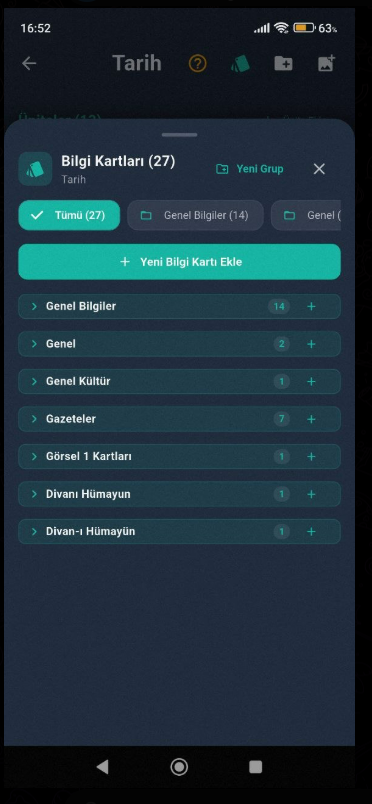

# 📱 Smart Notebook (Akıllı Not Defteri)


**Smart Notebook**, öğrencilerin, araştırmacıların ve not tutkunlarının tüm çalışma materyallerini (kitaplar, çizimler, görsel notlar, soru havuzları ve interaktif bilgi kartları) tek bir modern çatı altında toplamalarını sağlayan gelişmiş bir mobil uygulamadır.

---

## 📥 Uygulamayı İndir (Android APK)

Uygulamayı doğrudan Android cihazınıza indirip hemen kullanmaya başlayabilirsiniz! APK dosyaları bu depoda yer almaktadır:

| Paket | Açıklama | İndirme Bağlantısı |
|---|---|---|
| 🚀 **SmartNotebook.apk** | **Önerilen** (Tüm Güncel Android Telefonlar - ARM64) | [**📥 Buradan İndir (APK)**](apk/SmartNotebook.apk?raw=true) |
| 📱 **SmartNotebook-armeabi-v7a.apk** | Eski / 32-bit Android Cihazlar İçin | [**📥 İndir (32-bit APK)**](apk/SmartNotebook-armeabi-v7a.apk?raw=true) |

> 💡 **Kurulum İpucu:** APK dosyasını telefonunuza indirdikten sonra üzerine dokunup *"Bilinmeyen kaynaklardan yüklemeye izin ver"* seçeneğini onaylayarak saniyeler içinde kurulumu tamamlayabilirsiniz.

---

## 📸 Uygulama Ekran Görüntüsü

<div align="center">
  
</div>

---

## ✨ Temel Özellikler

### 🗂️ 1. Görsel Notlar & İnteraktif Bilgi Kartları (Flashcards)
- **Konu Başlıklarına Göre Gruplama:** Bilgi kartlarını konularına ve ünitelerine göre düzenli gruplar halinde görüntüleyin.
- **Sürükle-Bırak (Drag & Drop):** Bilgi kartlarını bir başlıktan diğerine parmağınızla sürükleyerek saniyeler içinde taşıyın.
- **Başlık Sıralama:** Başlıkların solundaki tutamaç (`≡`) ile konu gruplarının sırasını dilediğiniz gibi yukarı/aşağı taşıyarak özelleştirin.
- **Gelişmiş Kart Arama:** Aynı ders ve klasör altındaki tüm görsel kartlar arasında anında kelime araması yapın, bulunan kelimeye doğrudan odaklanın.
- **Çift Yönlü Çevirme (FlipCard):** Soru-cevap kartlarını ters yüz ederek interaktif pratik yapın.

### 📖 2. Kitap ve Sayfa Editörü (Dijital Not Defteri)
- **Katmanlı Çizim ve Metin Tahtası:** Her sayfada hem zengin metin düzenleme (kalın, italik, punto) hem de hassas çizim araçları (kalem, silgi, renk paleti).
- **Kitap Okuma Modu (Reader):** Sayfaları tam ekran, kesintisiz bir kitap formatında okuyun ve "İçindekiler" paneliyle dilediğiniz sayfaya tek dokunuşla geçin.
- **PDF Dışa Aktarma:** Tek bir sayfayı veya tüm kitabınızı dilediğiniz zaman yüksek çözünürlüklü PDF formatında kaydedip paylaşın.

### ⚡ 3. Akıllı Depolama ve Hızlı Senkronizasyon
- **Otomatik Kaydetme:** Herhangi bir kaydet butonuna basmanıza gerek kalmadan tüm notlarınız anlık olarak güvenle saklanır.
- **Çevrimdışı Çalışma Desteği:** `Hive` yerel NoSQL veritabanı sayesinde internet bağlantısına ihtiyaç duymadan ışık hızında çalışır.

---

## 🛠️ Geliştiriciler İçin Kurulum ve Çalıştırma

Projeyi yerel geliştirme ortamınızda derleyip çalıştırmak için:

1. **Depoyu Klonlayın:**
   ```bash
   git clone https://github.com/Ynsemreaykr/Smart-Notebook.git
   cd Smart-Notebook
   ```

2. **Gerekli Paketleri Yükleyin:**
   ```bash
   flutter pub get
   ```

3. **Uygulamayı Çalıştırın:**
   ```bash
   flutter run
   ```

4. **APK Çıktısı Almak İçin:**
   ```bash
   flutter build apk --release
   ```

---

## 📂 Proje Mimarisi

```text
lib/
 ├── application/          # State Management (Provider katmanı)
 │    ├── providers/       # BookProvider, PhotoNoteProvider vb.
 ├── domain/               # Veri modelleri ve iş kuralları
 │    ├── models/          # Flashcard, PhotoNote, Book vb.
 ├── data/                 # Veritabanı (Hive) ve dosya servisleri
 ├── presentation/         # Kullanıcı arayüzleri ve ekranlar
 │    ├── screens/         # PhotoNotesCategoryScreen, Viewer, Reader vb.
 │    └── widgets/         # Yeniden kullanılabilir widget'lar
 └── core/                 # Tema, renkler, sabitler ve yardımcı sınıflar
```

---

## 📄 Lisans
Bu proje [MIT](LICENSE) lisansı ile lisanslanmıştır.
